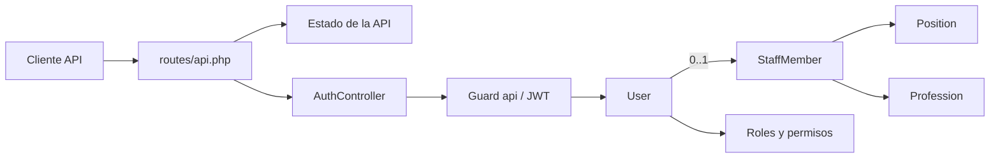

# Mapeo técnico del backend SEDALP

> Alcance: modelos, migraciones, API y seeders.
>
> Fecha de análisis: 9 de agosto de 2026.

## 1. Resumen del estado actual

El proyecto es una API construida con Laravel 13 y PostgreSQL. La funcionalidad expuesta actualmente se concentra en autenticación mediante JWT:

- Comprobar el estado de la API.
- Iniciar sesión.
- Consultar el usuario autenticado.
- Renovar el token JWT.
- Cerrar sesión e invalidar el token JWT.

También existe una ruta `/api/user` protegida con Sanctum. Sin embargo, el flujo principal de autenticación usa el guard `api` con JWT, por lo que actualmente conviven dos mecanismos de autenticación.

La base del dominio de personal ya está preparada mediante modelos y migraciones para cargos, profesiones y miembros del personal. También está preparada la autorización basada en roles y permisos. Estos módulos aún no tienen endpoints API propios.

## 2. Mapa general



## 3. Modelos

### `App\Models\User`

Representa las cuentas que pueden autenticarse.

| Aspecto | Detalle |
|---|---|
| Tabla | `users` |
| Traits | `HasApiTokens`, `HasFactory`, `HasRoles`, `Notifiable`, `SoftDeletes` |
| Contrato | `JWTSubject` |
| Asignación masiva | `staff_member_id`, `name`, `email`, `password` |
| Campos ocultos | `password`, `remember_token` |
| Casts | `email_verified_at` a fecha/hora; `password` con hash automático |
| Relación | `belongsTo(StaffMember::class)` mediante `staff_member_id` |
| JWT | Usa la clave primaria como identificador y no agrega claims personalizados |

### `App\Models\People\Position`

Representa un cargo institucional.

| Aspecto | Detalle |
|---|---|
| Tabla | `positions` |
| Traits | `HasFactory`, `SoftDeletes` |
| Asignación masiva | `name`, `description`, `active` |
| Casts | `active` a booleano |
| Relación | `hasMany(StaffMember::class)` |

### `App\Models\People\Profession`

Representa una profesión asignable al personal.

| Aspecto | Detalle |
|---|---|
| Tabla | `professions` |
| Traits | `HasFactory` |
| Asignación masiva | `name`, `active` |
| Casts | `active` a booleano |
| Relación | `hasMany(StaffMember::class)` |

### `App\Models\People\StaffMember`

Representa a una persona perteneciente al personal.

| Aspecto | Detalle |
|---|---|
| Tabla | `staff_members` |
| Traits | `HasFactory` |
| Asignación masiva declarada | `first_name`, `second_name`, apellidos, CI, datos personales, contacto, cargo, profesión, fechas laborales y estado |
| Casts | `birth_date` a fecha; `active` a booleano |
| Relaciones | Pertenece a un cargo y una profesión; puede tener una cuenta de usuario |

### Relaciones del dominio

```text
positions     1 ─────── N staff_members
professions   1 ─────── N staff_members
staff_members 1 ───── 0..1 users
users         N ─────── N roles
roles         N ─────── N permissions
users         N ─────── N permissions (asignación directa)
```

## 4. Migraciones

### Migraciones base de Laravel

| Migración | Tablas | Propósito |
|---|---|---|
| `0001_01_01_000000_create_users_table.php` | `users`, `password_reset_tokens`, `sessions` | Usuarios, recuperación de contraseña y sesiones almacenadas en base de datos |
| `0001_01_01_000001_create_cache_table.php` | `cache`, `cache_locks` | Caché y bloqueos de caché |
| `0001_01_01_000002_create_jobs_table.php` | `jobs`, `job_batches`, `failed_jobs` | Colas, lotes y registro de trabajos fallidos |
| `2026_08_03_051833_create_personal_access_tokens_table.php` | `personal_access_tokens` | Tokens personales de Laravel Sanctum |

### Migraciones del dominio

#### `positions`

- `id`.
- `name`: máximo 100 caracteres y único.
- `description`: opcional, máximo 150 caracteres.
- `active`: booleano, por defecto `true`.
- Marcas de tiempo y borrado lógico.

#### `professions`

- `id`.
- `name`: máximo 150 caracteres y único.
- `active`: booleano, por defecto `true`.
- Marcas de tiempo y borrado lógico.

#### `staff_members`

- Datos personales: `first_names`, `paternal_surname`, `maternal_surname`, `birth_date`.
- Documento: `ci` y `ci_complement`.
- Contacto: `phone`, `email`.
- Relaciones obligatorias: `position_id` y `profession_id`.
- Estado: `active`, por defecto `true`.
- Marcas de tiempo y borrado lógico.
- Índice compuesto para los apellidos.
- Restricción PostgreSQL: `ci` solo admite de 1 a 15 dígitos.
- Restricción PostgreSQL: el complemento, si existe, debe tener exactamente dos caracteres alfanuméricos en mayúscula.
- Índice único funcional sobre `ci` y el complemento normalizado, para impedir documentos duplicados.
- Las relaciones con cargo y profesión usan `restrictOnDelete()`.

#### Modificación de `users`

La migración `2026_08_08_031825_add_staff_member_id_and_soft_deletes_to_users_table.php` agrega:

- `staff_member_id`: opcional, único y relacionado con `staff_members`.
- Restricción de eliminación del miembro del personal si está asociado a un usuario.
- Borrado lógico mediante `deleted_at`.

### Roles y permisos

La migración `2026_08_08_041349_create_permission_tables.php`, proveniente de Spatie Laravel Permission, crea:

- `permissions`.
- `roles`.
- `model_has_permissions`.
- `model_has_roles`.
- `role_has_permissions`.

Esto permite asignar roles y permisos tanto directamente a modelos como a través de roles. El modelo `User` integra esta capacidad mediante `HasRoles` y utiliza el guard `api`.

## 5. API actual

Archivo principal: `routes/api.php`.

| Método | Ruta | Protección | Acción |
|---|---|---|---|
| `GET` | `/api/estado` | Pública | Devuelve estado básico de la API, base de datos declarada y versión del framework |
| `POST` | `/api/auth/login` | Pública | Valida email y contraseña; devuelve un token JWT |
| `GET` | `/api/auth/me` | `auth:api` | Devuelve el usuario autenticado mediante JWT |
| `POST` | `/api/auth/logout` | `auth:api` | Invalida el token JWT actual |
| `POST` | `/api/auth/refresh` | `auth:api` | Renueva el token JWT |
| `GET` | `/api/user` | `auth:sanctum` | Devuelve el usuario autenticado mediante Sanctum |

### Flujo de autenticación JWT

1. El cliente envía `email` y `password` a `/api/auth/login`.
2. El controlador valida ambos campos.
3. El guard `api`, configurado con driver `jwt`, intenta autenticar al usuario.
4. Si las credenciales son incorrectas, responde con HTTP `401`.
5. Si son correctas, devuelve `access_token`, tipo `bearer` y tiempo de expiración.
6. El cliente usa `Authorization: Bearer <token>` para acceder a `me`, `refresh` y `logout`.

### Respuestas relevantes

- Login correcto: mensaje, token, tipo de token y expiración en segundos.
- Login incorrecto: HTTP `401` y mensaje de credenciales incorrectas.
- `me`: objeto `user` autenticado.
- Logout: mensaje de cierre correcto.
- Refresh: token renovado, tipo y expiración.

## 6. Seeders

### `DatabaseSeeder`

Es el punto de entrada y ejecuta únicamente `SuperAdminSeeder`.

### `SuperAdminSeeder`

- Crea o reutiliza el rol `super_admin` con guard `api`.
- Crea o reutiliza un usuario administrador identificado por su correo institucional.
- Asigna el rol `super_admin` al usuario si todavía no lo posee.
- Usa `firstOrCreate`, por lo que puede ejecutarse repetidamente sin duplicar el rol o el usuario.
- La contraseña inicial está escrita directamente en el seeder; debe tratarse como una credencial temporal y sustituirse por configuración segura antes de un despliegue real.

No existen seeders para cargos, profesiones, miembros del personal ni permisos específicos.

## 7. Funcionalidad implementada frente a estructura preparada

| Área | Estado actual |
|---|---|
| Estado de la API | Implementado |
| Login JWT | Implementado |
| Consulta del usuario autenticado | Implementado |
| Renovación JWT | Implementado |
| Logout JWT | Implementado |
| Usuario mediante Sanctum | Ruta presente, separada del flujo JWT principal |
| Roles | Esquema, trait y rol `super_admin` preparados |
| Permisos | Esquema preparado; no hay permisos concretos sembrados ni endpoints |
| Cargos | Modelo y tabla preparados; sin API CRUD |
| Profesiones | Modelo y tabla preparados; sin API CRUD |
| Personal | Modelo y tabla preparados; sin API CRUD |

## 8. Observaciones técnicas detectadas

Estas observaciones describen el código actual; no implican que hayan sido corregidas durante este mapeo.

1. **Diferencia entre `StaffMember` y su tabla:** el modelo declara `first_name` y `second_name`, mientras la migración crea `first_names`. También declara `address`, `entry_date` y `resignation_date`, pero esas columnas no existen en la migración.
2. **Borrado lógico incompleto:** las tablas `professions` y `staff_members` tienen `deleted_at`, pero sus modelos no usan `SoftDeletes`. `Position` y `User` sí están alineados con sus tablas.
3. **Dos mecanismos de tokens:** el flujo de `AuthController` usa JWT, mientras `/api/user`, `HasApiTokens` y `personal_access_tokens` corresponden a Sanctum. Conviene definir cuál será el mecanismo oficial o documentar claramente por qué deben coexistir.
4. **Sin limitación explícita de intentos de login:** la ruta pública de login no muestra middleware `throttle` específico.
5. **Credencial inicial en código:** el seeder contiene una contraseña predeterminada. Debe cambiarse y extraerse a una configuración segura antes de producción.
6. **Rollback anidado:** el método `down()` de la migración que modifica `users` contiene un `Schema::table()` dentro de otro `Schema::table()`. Conviene simplificarlo antes de depender de rollbacks.
7. **API de dominio pendiente:** actualmente no hay controladores, validaciones, recursos ni rutas para administrar cargos, profesiones o personal.

## 9. Conclusión

El backend ya cuenta con autenticación JWT operativa y con la estructura inicial para usuarios, personal, cargos, profesiones, roles y permisos. A nivel funcional expuesto, el avance se limita principalmente al ciclo de autenticación y al endpoint de estado. La siguiente etapa natural sería alinear los modelos con el esquema y construir las APIs CRUD del dominio con autorización por roles y permisos.
