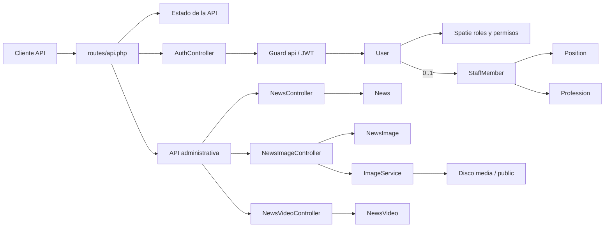

# Mapeo técnico del backend SEDALP

> Alcance: estructura del proyecto, autenticación, autorización, modelos, migraciones, API, multimedia, seeders y pruebas.
>
> Fecha de actualización: 25 de agosto de 2026.
>
> Fuente del inventario: archivos rastreados por Git y archivos no rastreados que no están excluidos por `.gitignore` (`git ls-files --cached --others --exclude-standard`). No se consideran `vendor`, `node_modules`, compilados, enlaces de almacenamiento ni otros artefactos ignorados.

## 1. Resumen del estado actual

El proyecto es un backend API construido con Laravel 13.8 y PHP `^8.3`, orientado a PostgreSQL. Actualmente expone tres bloques funcionales:

- Estado básico de la API.
- Autenticación mediante JWT: login, consulta del usuario, renovación y cierre de sesión.
- Administración de noticias, imágenes y videos, protegida por JWT y permisos.

La base del dominio institucional también está preparada mediante modelos y migraciones para usuarios, personal, cargos, profesiones, roles y permisos. Estos módulos todavía no tienen API CRUD propia.

El flujo activo de autenticación es JWT. Sanctum sigue instalado y conserva su migración de tokens personales, pero `HasApiTokens` y la ruta `/api/user` están comentados, por lo que no forma parte de la API activa.

## 2. Estructura relevante del proyecto

```text
backend-sedalp/
├── app/
│   ├── DTOs/Media/
│   │   └── ImageOptions.php
│   ├── Enums/
│   │   ├── Auth/{PermissionName,RoleName}.php
│   │   ├── Communication/NewsStatus.php
│   │   └── Media/{ImageFormat,ImageResizeMode}.php
│   ├── Http/
│   │   ├── Controllers/Api/
│   │   │   ├── Auth/AuthController.php
│   │   │   └── Admin/Communication/
│   │   │       ├── NewsController.php
│   │   │       ├── NewsImageController.php
│   │   │       └── NewsVideoController.php
│   │   ├── Requests/Communication/         # 8 Form Requests
│   │   └── Resources/Communication/        # 3 API Resources
│   ├── Models/
│   │   ├── User.php
│   │   ├── People/{Position,Profession,StaffMember}.php
│   │   └── Communication/{News,NewsImage,NewsVideo}.php
│   ├── Providers/AppServiceProvider.php
│   └── Services/Media/ImageService.php
├── bootstrap/
│   ├── app.php
│   └── providers.php
├── config/
│   ├── auth.php, jwt.php, permission.php, sanctum.php
│   ├── filesystems.php, images.php, intervention-image.php, media.php
│   ├── simred.php
│   └── configuración base de Laravel
├── database/
│   ├── factories/UserFactory.php
│   ├── migrations/                         # 13 migraciones
│   └── seeders/
│       ├── DatabaseSeeder.php
│       ├── RolesAndPermissionsSeeder.php
│       ├── SuperAdminSeeder.php
│       └── NewsPermissionsSeeder.php
├── resources/
│   ├── css/app.css
│   ├── js/app.js
│   └── views/welcome.blade.php
├── routes/{api,console,web}.php
├── tests/
│   ├── Feature/ExampleTest.php
│   ├── Unit/ExampleTest.php
│   ├── Pest.php
│   └── TestCase.php
├── composer.json
├── package.json
└── vite.config.js
```

Los directorios `.agents/`, archivos de configuración del repositorio y marcadores `.gitignore` de `storage/`, `database/` y `bootstrap/cache/` son parte del conjunto no ignorado, pero no intervienen directamente en la arquitectura de ejecución de la aplicación.

## 3. Mapa general de arquitectura



## 4. Modelos y relaciones

### `App\Models\User`

Representa las cuentas autenticables.

| Aspecto | Detalle |
|---|---|
| Tabla | `users` |
| Traits | `HasFactory`, `HasRoles`, `Notifiable`, `SoftDeletes` |
| Contrato | `JWTSubject` |
| Asignación masiva | `staff_member_id`, `email`, `password` |
| Campos ocultos | `password`, `remember_token` |
| Casts | `email_verified_at` a fecha/hora; `password` con hash automático |
| Relaciones | Pertenece opcionalmente a `StaffMember`; crea y actualiza muchas noticias |
| JWT | Usa la clave primaria como identificador y no agrega claims personalizados |

La columna `name` fue eliminada mediante una migración posterior. `HasApiTokens` está comentado.

### Dominio `People`

| Modelo | Tabla | Rasgos y relaciones principales |
|---|---|---|
| `Position` | `positions` | `HasFactory`, `SoftDeletes`; tiene muchos miembros del personal |
| `Profession` | `professions` | `HasFactory`, `SoftDeletes`; tiene muchos miembros del personal |
| `StaffMember` | `staff_members` | `HasFactory`, `SoftDeletes`; pertenece a cargo y profesión; puede tener un usuario |

`StaffMember` permite asignación masiva de `first_names`, apellidos, fecha de nacimiento, CI, complemento, teléfono, correo, cargo, profesión y estado. El modelo está alineado con las columnas actuales de su migración.

### Dominio `Communication`

#### `News`

| Aspecto | Detalle |
|---|---|
| Tabla | `news` |
| Traits | `HasFactory`, `SoftDeletes` |
| Contenido | Título, subtítulo, resumen, descripción y documento JSON de TipTap |
| Estado | Enum `NewsStatus`: `draft`, `published`, `archived` |
| Auditoría | `created_by` obligatorio y `updated_by` opcional, ambos relacionados con `User` |
| Multimedia | Tiene muchas imágenes y muchos videos, ordenados por `position` |
| Búsqueda | Scope sobre `title`, `subtitle` y `excerpt` mediante `ILIKE` de PostgreSQL |
| Slug | Único; se genera al crear y no cambia automáticamente al editar el título |

#### `NewsImage`

- Pertenece a una noticia.
- Guarda un nombre base UUID sin extensión, texto alternativo, pie de foto opcional y posición.
- Usa el directorio lógico `communication/news`.
- Cada nombre de archivo es único y cada posición es única dentro de una noticia.

#### `NewsVideo`

- Pertenece a una noticia.
- Guarda URL de YouTube, título y posición.
- Cada posición es única dentro de una noticia.

### Relaciones del dominio

```text
positions     1 ─────── N staff_members
professions   1 ─────── N staff_members
staff_members 1 ───── 0..1 users
users         N ─────── N roles
roles         N ─────── N permissions
users         N ─────── N permissions (asignación directa)
users         1 ─────── N news (created_by / updated_by)
news          1 ─────── N news_images
news          1 ─────── N news_videos
```

## 5. Migraciones y esquema de datos

### Migraciones base

| Migración | Tablas o cambio | Propósito |
|---|---|---|
| `0001_01_01_000000_create_users_table.php` | `users`, `password_reset_tokens`, `sessions` | Usuarios, recuperación de contraseña y sesiones |
| `0001_01_01_000001_create_cache_table.php` | `cache`, `cache_locks` | Caché y bloqueos |
| `0001_01_01_000002_create_jobs_table.php` | `jobs`, `job_batches`, `failed_jobs` | Colas, lotes y trabajos fallidos |
| `2026_08_03_051833_create_personal_access_tokens_table.php` | `personal_access_tokens` | Infraestructura de Sanctum actualmente inactiva en rutas/modelo |

### Personal y usuarios

| Migración | Resultado principal |
|---|---|
| `2026_08_08_022340_create_positions_table.php` | Cargos únicos, descripción opcional, estado y borrado lógico |
| `2026_08_08_022349_create_professions_table.php` | Profesiones únicas, estado y borrado lógico |
| `2026_08_08_022355_create_staff_members_table.php` | Datos personales, documento, contacto, cargo, profesión, estado y borrado lógico |
| `2026_08_08_031825_add_staff_member_id_and_soft_deletes_to_users_table.php` | Relación opcional y única con personal; borrado lógico de usuarios |
| `2026_08_08_041349_create_permission_tables.php` | Tablas de roles y permisos de Spatie |
| `2026_08_10_051438_remove_name_from_users_table.php` | Elimina `name` de `users` |

La tabla `staff_members` aplica restricciones PostgreSQL al formato del CI y su complemento, un índice único funcional para evitar documentos duplicados y relaciones `restrictOnDelete()` con cargos y profesiones.

### Noticias y multimedia

| Migración | Resultado principal |
|---|---|
| `2026_08_24_222819_create_news_table.php` | Noticias con slug único, contenido `jsonb`, estado restringido, publicación, auditoría, índices y borrado lógico |
| `2026_08_24_222820_create_news_images_table.php` | Imágenes asociadas, nombre UUID, metadatos, posición no negativa y eliminación en cascada |
| `2026_08_24_222821_create_news_videos_table.php` | Videos de YouTube, posición no negativa y eliminación en cascada |

Las tablas de imágenes y videos tienen una restricción única compuesta sobre `news_id` y `position`. La cascada se ejecuta al eliminar físicamente una noticia; el borrado habitual de `News` es lógico.

## 6. Autenticación y autorización

### JWT

El guard predeterminado `api` usa el driver `jwt` y el proveedor Eloquent de `User`.

1. El cliente envía `email` y `password` a `/api/auth/login`.
2. La solicitud se limita a cinco intentos por minuto por combinación de correo normalizado e IP.
3. El guard intenta autenticar las credenciales.
4. Un fallo responde con HTTP `401`; un exceso de intentos responde con HTTP `429`.
5. Un login correcto devuelve `access_token`, tipo `bearer` y expiración en segundos.
6. El token Bearer permite usar `me`, `refresh`, `logout` y las rutas administrativas autorizadas.

### Roles y permisos

- `RoleName` define `super_admin`, `director`, `responsable_programas` y `tecnico`.
- `PermissionName` define 39 permisos para personal, cargos, profesiones, usuarios, roles, regiones, provincias, municipios, asignaciones regionales y asistencias técnicas.
- El módulo de noticias agrega `news.view`, `news.create`, `news.update`, `news.delete` y `news.publish`.
- El rol `comunicador` recibe los cinco permisos de noticias.
- `Gate::before` concede todas las capacidades al rol `super_admin`.
- Las rutas administrativas validan permisos con middleware `can:*`; los Form Requests repiten la autorización correspondiente.
- Cambiar una noticia hacia o desde `published` exige además `news.publish` dentro del controlador.

## 7. API actual

Archivo principal: `routes/api.php`. La aplicación registra 19 rutas API propias.

### Estado y autenticación

| Método | Ruta | Protección | Acción |
|---|---|---|---|
| `GET` | `/api/estado` | Pública | Devuelve estado básico, base declarada y versión del framework |
| `POST` | `/api/auth/login` | `throttle:login` | Valida credenciales y emite JWT |
| `GET` | `/api/auth/me` | `auth:api` | Devuelve el usuario JWT autenticado |
| `POST` | `/api/auth/logout` | `auth:api` | Invalida el JWT actual |
| `POST` | `/api/auth/refresh` | `auth:api` | Renueva el JWT |

### Noticias

Todas las rutas siguientes usan `auth:api`, bindings anidados con alcance y el permiso indicado.

| Método | Ruta | Permiso | Acción |
|---|---|---|---|
| `GET` | `/api/admin/news` | `news.view` | Lista paginada con búsqueda y filtro por estado |
| `POST` | `/api/admin/news` | `news.create` | Crea una noticia; publicar exige `news.publish` |
| `GET` | `/api/admin/news/{news}` | `news.view` | Obtiene una noticia con autor, editor y multimedia |
| `PUT`, `PATCH` | `/api/admin/news/{news}` | `news.update` | Actualiza la noticia sin regenerar su slug |
| `DELETE` | `/api/admin/news/{news}` | `news.delete` | Aplica borrado lógico y registra quién la eliminó |

El listado acepta `search`, `status` y `per_page` entre 1 y 100; por defecto devuelve 15 registros ordenados desde el más reciente.

### Imágenes de noticias

| Método | Ruta | Permiso | Acción |
|---|---|---|---|
| `POST` | `/api/admin/news/{news}/images` | `news.update` | Sube de 1 a 20 imágenes |
| `PATCH` | `/api/admin/news/{news}/images/{image}` | `news.update` | Edita `alt` y/o `caption` |
| `PUT` | `/api/admin/news/{news}/images/reorder` | `news.update` | Reordena todas las imágenes con posiciones consecutivas desde 0 |
| `DELETE` | `/api/admin/news/{news}/images/{image}` | `news.update` | Elimina registro, variantes físicas y normaliza posiciones |

Cada archivo debe ser JPG, JPEG, PNG o WebP y pesar como máximo 10 MB. El campo `alt` es obligatorio.

### Videos de noticias

| Método | Ruta | Permiso | Acción |
|---|---|---|---|
| `POST` | `/api/admin/news/{news}/videos` | `news.update` | Agrega URL de YouTube y título |
| `PATCH` | `/api/admin/news/{news}/videos/{video}` | `news.update` | Edita URL y/o título |
| `PUT` | `/api/admin/news/{news}/videos/reorder` | `news.update` | Reordena todos los videos con posiciones consecutivas desde 0 |
| `DELETE` | `/api/admin/news/{news}/videos/{video}` | `news.update` | Elimina el video y normaliza posiciones |

## 8. Procesamiento de imágenes

`ImageService` concentra el almacenamiento y evita que los controladores decidan rutas o formatos físicos.

- `ImageOptions` valida directorio, formatos, dimensiones, modo de redimensionado y calidades.
- `ImageResizeMode` permite conservar tamaño, reducir proporcionalmente o recortar/reducir a una cobertura.
- `ImageFormat` admite WebP, PNG y JPEG.
- Las imágenes de noticias se reducen proporcionalmente hasta un ancho máximo de 1920 px.
- Por cada carga se generan variantes `.webp`, `.png` y `.jpeg` con el mismo UUID base.
- El disco se toma de `MEDIA_DISK` y usa `public` como valor predeterminado.
- Si falla una variante, el servicio intenta limpiar todas las variantes generadas.
- `NewsImageResource` devuelve `filename` sin extensión y `baseUrl`; el cliente construye la URL de la variante requerida.

## 9. Seeders

### `DatabaseSeeder`

Ejecuta, en este orden:

1. `RolesAndPermissionsSeeder`.
2. `SuperAdminSeeder`.
3. `NewsPermissionsSeeder`.

### `RolesAndPermissionsSeeder`

- Crea todos los permisos definidos en `PermissionName` con guard `api`.
- Crea los cuatro roles definidos en `RoleName`.
- Sincroniza permisos específicos para `director`, `responsable_programas` y `tecnico`.
- Limpia la caché de Spatie antes y después de las operaciones.

### `SuperAdminSeeder`

- Lee correo y contraseña desde `config/simred.php`, respaldado por variables `SUPER_ADMIN_*`.
- Crea o reutiliza el rol y el usuario.
- Asigna `super_admin` si todavía no está asociado.
- Ya no contiene la contraseña escrita directamente en el código.

### `NewsPermissionsSeeder`

- Crea o reutiliza los cinco permisos de noticias.
- Crea o reutiliza el rol `comunicador`.
- Sincroniza todos los permisos de noticias con ese rol.

No existen seeders para cargos, profesiones ni miembros del personal.

## 10. Configuración y dependencias relevantes

| Área | Implementación |
|---|---|
| Framework | Laravel `^13.8` |
| Autenticación | `php-open-source-saver/jwt-auth` `^2.9`; Sanctum `^4.0` instalado pero inactivo en rutas |
| Autorización | `spatie/laravel-permission` `^8.3` |
| Imágenes | Intervention Image `^4.0` e integración Laravel `^4.1` |
| Persistencia | PostgreSQL, con `jsonb`, `ILIKE` y restricciones SQL específicas |
| Frontend incluido | Plantilla Blade mínima, Vite 8 y Tailwind CSS 4 |
| Pruebas | Pest 5 con configuración base |

`bootstrap/app.php` fuerza respuestas JSON para excepciones de rutas `api/*` y configura el endpoint de salud `/up`.

## 11. Funcionalidad implementada frente a estructura preparada

| Área | Estado actual |
|---|---|
| Estado de la API | Implementado |
| Ciclo JWT: login, `me`, refresh y logout | Implementado |
| Límite de intentos de login | Implementado |
| Roles y permisos base | Esquema, enums y seeders implementados |
| Noticias administrativas | CRUD implementado y protegido por permisos |
| Imágenes de noticias | Carga múltiple, conversión, edición, orden y eliminación implementados |
| Videos de noticias | Alta, edición, orden y eliminación implementados |
| Sanctum | Dependencia y tabla presentes; flujo inactivo |
| Cargos | Modelo y tabla preparados; sin API CRUD |
| Profesiones | Modelo y tabla preparados; sin API CRUD |
| Personal | Modelo y tabla preparados; sin API CRUD |
| Usuarios, roles y permisos | Sin API administrativa propia |
| Regiones, provincias, municipios, asignaciones y asistencias | Solo nombres de permisos; sin modelos, tablas ni API |
| Pruebas del dominio | Pendientes; solo existen las pruebas de ejemplo del esqueleto |

## 12. Observaciones técnicas detectadas

Estas observaciones describen el código actual; este mapeo no las corrige.

1. **Archivo `.env` versionado:** `.env` no está excluido porque su regla está comentada en `.gitignore` y el archivo aparece en el inventario de Git. Esto puede exponer credenciales y secretos; debe revisarse antes de compartir o publicar el repositorio.
2. **Sanctum residual:** el paquete y `personal_access_tokens` permanecen, aunque el modelo y las rutas usan únicamente JWT. Conviene confirmar si se conservarán para una integración futura o se retirarán.
3. **Eliminación física de imágenes:** `NewsImageController` llama a `Log::error()` en el manejo de fallos, pero no importa la fachada `Log`; si la eliminación del archivo lanza una excepción, ese bloque puede fallar con clase no encontrada.
4. **Borrado lógico de noticias:** eliminar una noticia no elimina sus filas multimedia ni archivos físicos, porque la cascada de la base de datos solo actúa en una eliminación física. Esto puede ser intencional para restauración, pero necesita una política de limpieza definitiva.
5. **Cobertura de pruebas:** no hay pruebas específicas para autenticación, permisos, noticias, reordenamiento ni procesamiento de imágenes.
6. **Factories incompletas:** solo existe `UserFactory`; los modelos de personal y comunicación usan `HasFactory` sin factories propias.
7. **Configuración del superadministrador:** `SuperAdminSeeder` exige `SUPER_ADMIN_NAME`, aunque `users.name` fue eliminado y el valor no se utiliza al crear el usuario.
8. **Migración de cargos:** `2026_08_08_022340_create_positions_table.php` contiene texto HTML antes de `<?php`, lo que puede producir salida no deseada al cargar la migración.
9. **Permisos de noticias separados:** los permisos `news.*` y el rol `comunicador` no están integrados en `PermissionName` y `RoleName`; actualmente se administran en un seeder separado.
10. **Módulos institucionales pendientes:** existen permisos para varias áreas que todavía no tienen persistencia ni endpoints implementados.

## 13. Cambios reflejados desde el mapeo anterior

- Se eliminó `name` de usuarios y se ajustó el modelo.
- Se alineó `StaffMember` con su migración y se activó `SoftDeletes` en personal y profesiones.
- Se reemplazó la credencial fija del superadministrador por configuración de entorno.
- Se agregaron enums, roles, permisos y sus seeders.
- Se añadió el rate limiter de login.
- Se desactivó la ruta Sanctum `/api/user` y el trait `HasApiTokens`.
- Se incorporó el módulo administrativo de noticias con validaciones, recursos, auditoría y autorización.
- Se incorporó gestión ordenada de imágenes y videos.
- Se agregó procesamiento de imágenes con variantes WebP, PNG y JPEG.
- Se añadieron las tres migraciones de comunicación y la configuración multimedia.

## 14. Conclusión

El backend evolucionó de una base centrada en autenticación a una API administrativa con un primer módulo funcional completo: noticias y su contenido multimedia. JWT y la autorización por roles/permisos ya están integrados en las rutas administrativas; el dominio de personal continúa preparado a nivel de persistencia, pero sin endpoints. Las prioridades técnicas visibles son proteger el archivo `.env`, añadir pruebas del dominio, definir el ciclo de vida de archivos multimedia y resolver las observaciones de integración menores antes de ampliar los módulos institucionales.
