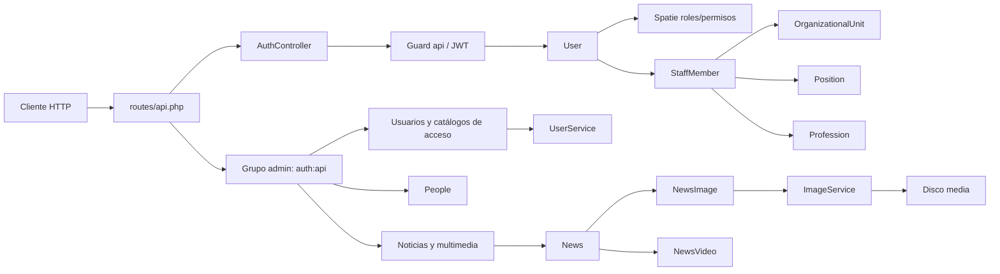

# Mapeo técnico del backend SEDALP

> Fecha de actualización: 27 de agosto de 2026.
>
> Alcance: código propio, estructura, dominios, modelos, relaciones, migraciones, esquema y tipos PostgreSQL, autenticación, autorización, API, validaciones, recursos, servicios, multimedia, seeders, configuración y pruebas.
>
> Método de inventario: `git ls-files --cached --others --exclude-standard`, inspección del código, `php artisan route:list --except-vendor --json`, `php artisan migrate:status`, `php artisan db:show` y `php artisan db:table`.
>
> Exclusiones: se respetó `.gitignore`. No se mapearon `vendor/`, `node_modules/`, `public/build/`, `public/storage/`, logs, cachés ni otros artefactos generados o ignorados. El contenido de `.env` tampoco se documenta para no exponer secretos.

## 1. Resumen ejecutivo

SEDALP es actualmente un backend administrativo API-first construido con Laravel. Los dominios funcionales implementados son:

- autenticación JWT;
- autorización por roles y permisos;
- usuarios vinculados a miembros del personal;
- unidades organizacionales, cargos, profesiones y personal;
- noticias con imágenes y videos ordenables;
- infraestructura Laravel para caché, sesiones y colas.

Inventario actual:

| Elemento | Cantidad |
|---|---:|
| Archivos no ignorados inventariados | 160 |
| Archivos PHP | 103 |
| Modelos propios | 8 |
| Controladores, incluido el controlador base | 11 |
| Form Requests | 20 |
| API Resources | 8 |
| Servicios propios | 2 |
| DTO | 1 |
| Enums | 5 |
| Migraciones | 14 |
| Tablas existentes | 22 |
| Endpoints API efectivos y únicos | 48 |
| Rutas adicionales | `/` y `/up` |

Los 48 endpoints API se distribuyen así: 5 de estado/autenticación, 14 de noticias y multimedia, 20 de People y 9 de usuarios/catálogos de acceso.

Sanctum está instalado y su tabla existe, pero la autenticación activa usa JWT. No hay una API pública de noticias: todas las operaciones de noticias están bajo `/api/admin` y requieren autenticación y permisos.

## 2. Plataforma y dependencias

### Entorno verificado

| Componente | Versión o configuración |
|---|---|
| PHP requerido | `^8.3` |
| PHP local | 8.5.9 |
| Laravel requerido | `^13.8` |
| Laravel bloqueado/ejecutado | 13.23.0 |
| PostgreSQL local | 18.4 |
| Base predeterminada | `pgsql` |
| Aplicación | `SEDALP API` |
| Entorno local | `local`, debug activo |
| Zona horaria | UTC |
| Locale | `en` |
| Caché / cola / sesión | Base de datos |

### Dependencias PHP directas bloqueadas

| Paquete | Versión | Uso |
|---|---:|---|
| `laravel/framework` | 13.23.0 | Framework |
| `php-open-source-saver/jwt-auth` | 2.9.2 | JWT |
| `spatie/laravel-permission` | 8.3.0 | Roles y permisos |
| `laravel/sanctum` | 4.3.3 | Tokens personales; flujo inactivo |
| `intervention/image` | 4.3.1 | Procesamiento de imágenes |
| `intervention/image-laravel` | 4.1.1 | Integración con Laravel |
| `laravel/tinker` | 3.0.2 | Herramienta de desarrollo |
| `pestphp/pest` | 5.0.3 | Pruebas |
| `pestphp/pest-plugin-laravel` | 5.0.1 | Integración Pest/Laravel |
| `laravel/pint` | 1.30.3 | Formato PHP |
| `laravel/boost` | 2.4.13 | Herramientas de desarrollo |

### Frontend mínimo incluido

El repositorio no contiene una aplicación frontend de negocio. Incluye la vista `welcome.blade.php`, un `app.js` vacío, Tailwind CSS y Vite.

| Paquete bloqueado | Versión |
|---|---:|
| `vite` | 8.2.0 |
| `tailwindcss` | 4.3.3 |
| `@tailwindcss/vite` | 4.3.3 |
| `laravel-vite-plugin` | 3.1.3 |
| `concurrently` | 9.2.4 |

## 3. Estructura relevante

```text
backend-sedalp/
├── app/
│   ├── DTOs/Media/ImageOptions.php
│   ├── Enums/
│   │   ├── Auth/{PermissionName,RoleName}.php
│   │   ├── Communication/NewsStatus.php
│   │   └── Media/{ImageFormat,ImageResizeMode}.php
│   ├── Http/
│   │   ├── Controllers/
│   │   │   ├── Controller.php
│   │   │   └── Api/
│   │   │       ├── Auth/AuthController.php
│   │   │       └── Admin/
│   │   │           ├── AccessControl/{AccessCatalogController,UserController}.php
│   │   │           ├── People/{OrganizationalUnitController,PositionController,ProfessionController,StaffMemberController}.php
│   │   │           └── Communication/{NewsController,NewsImageController,NewsVideoController}.php
│   │   ├── Requests/
│   │   │   ├── AccessControl/       # 4
│   │   │   ├── People/              # 8
│   │   │   └── Communication/       # 8
│   │   └── Resources/
│   │       ├── AccessControl/       # 1
│   │       ├── People/              # 4
│   │       └── Communication/       # 3
│   ├── Models/
│   │   ├── User.php
│   │   ├── People/{OrganizationalUnit,Position,Profession,StaffMember}.php
│   │   └── Communication/{News,NewsImage,NewsVideo}.php
│   ├── Providers/AppServiceProvider.php
│   └── Services/
│       ├── AccessControl/UserService.php
│       └── Media/ImageService.php
├── bootstrap/{app,providers}.php
├── config/                         # Laravel, JWT, permisos, imágenes y SIMRED
├── database/
│   ├── factories/UserFactory.php
│   ├── migrations/                # 14
│   └── seeders/                   # 4
├── resources/{css,js,views}/
├── routes/{api,console,web}.php
├── tests/{Feature,Unit}/
├── composer.json / composer.lock
├── package.json / package-lock.json
├── phpunit.xml
└── vite.config.js
```

`.agents/` y `AGENTS.md` contienen instrucciones de desarrollo, no componentes de ejecución. Los marcadores `.gitignore` dentro de `storage/`, `database/` y `bootstrap/cache/` solo conservan la estructura de directorios.

## 4. Arquitectura y dominios



### Tipos de datos de negocio

| Dominio | Datos |
|---|---|
| Identidad | usuario, correo, contraseña hasheada, verificación y vínculo opcional con personal |
| Organización | unidades organizacionales, códigos institucionales, cargos y profesiones |
| Personal | nombres, apellidos, fecha de nacimiento, CI, complemento, teléfono, correo, unidad, cargo, profesión y estado |
| Acceso | roles, permisos, asignaciones polimórficas y permisos por rol |
| Comunicación | noticias, slug, resumen, descripción, documento TipTap JSON, estado y fecha de publicación |
| Multimedia | variantes físicas de imagen y referencias de videos de YouTube |
| Infraestructura | sesiones, reset de contraseñas, tokens Sanctum, caché, locks, trabajos, lotes y fallos |

## 5. Modelos Eloquent

| Modelo | Tabla | Traits | Fillable | Casts | Relaciones |
|---|---|---|---|---|---|
| `User` | `users` | `HasFactory`, `HasRoles`, `Notifiable`, `SoftDeletes` | `staff_member_id`, `email`, `password` | `email_verified_at: datetime`, `password: hashed` | `belongsTo StaffMember`; `hasMany News` como creador y editor |
| `OrganizationalUnit` | `organizational_units` | `HasFactory`, `SoftDeletes` | `name`, `code`, `description`, `active` | `active: boolean` | `hasMany StaffMember` |
| `Position` | `positions` | `HasFactory`, `SoftDeletes` | `name`, `description`, `active` | `active: boolean` | `hasMany StaffMember` |
| `Profession` | `professions` | `HasFactory`, `SoftDeletes` | `name`, `active` | `active: boolean` | `hasMany StaffMember` |
| `StaffMember` | `staff_members` | `HasFactory`, `SoftDeletes` | datos personales, contacto, tres FK y `active` | `birth_date: date`, `active: boolean` | pertenece a unidad, cargo y profesión; tiene un usuario |
| `News` | `news` | `HasFactory`, `SoftDeletes` | contenido, publicación y estado; no incluye campos de auditoría | `content: array`, `published_at: date`, `status: NewsStatus` | creador, editor, imágenes y videos |
| `NewsImage` | `news_images` | `HasFactory` | `news_id`, `filename`, `alt`, `caption`, `position` | `position: integer` | pertenece a noticia |
| `NewsVideo` | `news_videos` | `HasFactory` | `news_id`, `youtube_url`, `title`, `position` | `position: integer` | pertenece a noticia |

`User` implementa `JWTSubject`: usa su PK como `sub` y no agrega claims personalizados. `password` y `remember_token` están ocultos. La columna histórica `users.name` fue eliminada.

`News::scopeSearch()` busca con `ILIKE` sobre título, subtítulo y resumen. Las relaciones de imágenes y videos siempre se ordenan por `position`.

### Enums y DTO

| Tipo | Valores o propósito |
|---|---|
| `NewsStatus` | `draft`, `published`, `archived` |
| `RoleName` | `super_admin`, `director`, `responsable`, `tecnico` |
| `ImageFormat` | `webp`, `png`, `jpeg` |
| `ImageResizeMode` | `none`, `scale_down`, `cover_down` |
| `PermissionName` | 44 permisos base descritos en la sección de autorización |
| `ImageOptions` | directorio, formatos, modo, dimensiones, calidad WebP/JPEG y JPEG progresivo; valida directorios, duplicados, dimensiones y calidad 1–100 |

## 6. Esquema de datos PostgreSQL

### 6.1 Tablas de identidad y People

La notación `timestamp` corresponde a `timestamp(0) without time zone`.

| Tabla | Columnas y tipos efectivos |
|---|---|
| `users` | `id bigint PK identity`; `staff_member_id bigint NULL UNIQUE FK`; `email varchar(255) UNIQUE`; `email_verified_at timestamp NULL`; `password varchar(255)`; `remember_token varchar(100) NULL`; `created_at timestamp NULL`; `updated_at timestamp NULL`; `deleted_at timestamp NULL` |
| `organizational_units` | `id bigint PK identity`; `name varchar(150) UNIQUE`; `code varchar(50) UNIQUE`; `description varchar(255) NULL`; `active boolean DEFAULT true`; timestamps; `deleted_at` |
| `positions` | `id bigint PK identity`; `name varchar(100) UNIQUE`; `description varchar(150) NULL`; `active boolean DEFAULT true`; timestamps; `deleted_at` |
| `professions` | `id bigint PK identity`; `name varchar(150) UNIQUE`; `active boolean DEFAULT true`; timestamps; `deleted_at` |
| `staff_members` | `id bigint PK identity`; `first_names varchar(100)`; `paternal_surname varchar(80) NULL`; `maternal_surname varchar(80) NULL`; `ci varchar(15)`; `ci_complement varchar(4) NULL`; `birth_date date NULL`; `phone varchar(20) NULL`; `email varchar(254) NULL`; `position_id bigint FK`; `profession_id bigint FK`; `organizational_unit_id bigint FK`; `active boolean DEFAULT true`; timestamps; `deleted_at` |

Reglas importantes:

- `users.staff_member_id` es opcional, único y usa `ON DELETE RESTRICT`.
- La unicidad de `users.email` incluye filas borradas lógicamente.
- Las tres FK de `staff_members` usan `ON DELETE RESTRICT`.
- `staff_members.ci` debe cumplir `^[0-9]{1,15}$`.
- `ci_complement`, cuando existe, debe tener exactamente dos caracteres `[A-Z0-9]`.
- Un índice funcional único evita repetir `(ci, COALESCE(ci_complement, ''))`, también entre filas borradas lógicamente.
- Existe un índice compuesto por apellidos y un índice por `organizational_units.active`.

### 6.2 Noticias y multimedia

| Tabla | Columnas y tipos efectivos |
|---|---|
| `news` | `id bigint PK identity`; `created_by bigint FK`; `updated_by bigint NULL FK`; `slug varchar(255) UNIQUE`; `title varchar(255)`; `subtitle varchar(255) NULL`; `excerpt text`; `description text`; `content jsonb`; `published_at date NULL`; `status varchar(20) DEFAULT 'draft'`; timestamps; `deleted_at` |
| `news_images` | `id bigint PK identity`; `news_id bigint FK`; `filename varchar(36) UNIQUE`; `alt varchar(255)`; `caption text NULL`; `position integer`; timestamps |
| `news_videos` | `id bigint PK identity`; `news_id bigint FK`; `youtube_url varchar(2048)`; `title varchar(255)`; `position integer`; timestamps |

Reglas importantes:

- `news.status` solo admite `draft`, `published` o `archived`.
- `created_by` y `updated_by` referencian `users` con `ON DELETE RESTRICT`.
- Hay índices sobre `(status, published_at)`, `created_by` y `updated_by`.
- `news_images` y `news_videos` usan `ON DELETE CASCADE` ante una eliminación física de la noticia.
- `position >= 0` y `(news_id, position)` es único en ambas tablas.
- `filename` almacena solo el UUID base, sin extensión.

### 6.3 Roles y permisos

| Tabla | Columnas y restricciones |
|---|---|
| `permissions` | `id bigint PK`; `name varchar(255)`; `guard_name varchar(255)`; timestamps; UNIQUE `(name, guard_name)` |
| `roles` | `id bigint PK`; `name varchar(255)`; `guard_name varchar(255)`; timestamps; UNIQUE `(name, guard_name)` |
| `model_has_permissions` | `permission_id bigint FK CASCADE`; `model_type varchar(255)`; `model_id bigint`; PK compuesta por los tres campos |
| `model_has_roles` | `role_id bigint FK CASCADE`; `model_type varchar(255)`; `model_id bigint`; PK compuesta por los tres campos |
| `role_has_permissions` | `permission_id bigint FK CASCADE`; `role_id bigint FK CASCADE`; PK compuesta |

Spatie está configurado sin equipos (`permission.teams=false`) y con guard `api`.

### 6.4 Tablas de infraestructura

| Tabla | Columnas |
|---|---|
| `personal_access_tokens` | PK bigint; morfo `tokenable_type/tokenable_id`; `name text`; `token varchar(64) UNIQUE`; `abilities text NULL`; `last_used_at`, `expires_at` y timestamps |
| `password_reset_tokens` | `email varchar(255) PK`; `token varchar(255)`; `created_at timestamp NULL` |
| `sessions` | `id varchar(255) PK`; `user_id bigint NULL` indexado, sin FK; IP, user agent, payload y última actividad |
| `cache` | `key varchar(255) PK`; `value text`; `expiration bigint` indexado |
| `cache_locks` | `key varchar(255) PK`; `owner varchar(255)`; `expiration bigint` indexado |
| `jobs` | PK bigint; cola, payload, intentos y marcas Unix de reserva/disponibilidad/creación |
| `job_batches` | ID string PK; nombre, contadores, IDs fallidos, opciones y marcas Unix |
| `failed_jobs` | PK bigint; UUID único, conexión, cola, payload, excepción y `failed_at` |
| `migrations` | `id integer PK identity`; `migration varchar(255)`; `batch integer` |

No se detectaron vistas ni tipos definidos por el usuario. `jsonb` es un tipo nativo de PostgreSQL.

### 6.5 Relaciones

```text
organizational_units 1 ───── N staff_members
positions            1 ───── N staff_members
professions          1 ───── N staff_members
staff_members        1 ─── 0..1 users
users                N ───── N roles
users                N ───── N permissions (soportado por Spatie)
roles                N ───── N permissions
users                1 ───── N news mediante created_by
users                1 ───── N news mediante updated_by
news                 1 ───── N news_images
news                 1 ───── N news_videos
```

### 6.6 Migraciones

Las 14 migraciones están aplicadas en el entorno local, todas en el batch 1.

| Migración | Efecto |
|---|---|
| `0001_01_01_000000_create_users_table.php` | Crea usuarios, reset de contraseñas y sesiones |
| `0001_01_01_000001_create_cache_table.php` | Crea caché y locks |
| `0001_01_01_000002_create_jobs_table.php` | Crea jobs, batches y failed jobs |
| `2026_08_03_051833_create_personal_access_tokens_table.php` | Crea tokens de Sanctum |
| `2026_08_08_022340_create_positions_table.php` | Crea cargos |
| `2026_08_08_022349_create_professions_table.php` | Crea profesiones |
| `2026_08_08_022350_create_organizational_units_table.php` | Crea unidades organizacionales |
| `2026_08_08_022355_create_staff_members_table.php` | Crea personal, FK, checks e índices |
| `2026_08_08_031825_add_staff_member_id_and_soft_deletes_to_users_table.php` | Vincula usuarios con personal y agrega soft delete |
| `2026_08_08_041349_create_permission_tables.php` | Crea las cinco tablas de Spatie |
| `2026_08_10_051438_remove_name_from_users_table.php` | Elimina `users.name` |
| `2026_08_24_222819_create_news_table.php` | Crea noticias, auditoría, estado, JSONB e índices |
| `2026_08_24_222820_create_news_images_table.php` | Crea imágenes y orden por noticia |
| `2026_08_24_222821_create_news_videos_table.php` | Crea videos y orden por noticia |

## 7. Autenticación y autorización

### JWT

- El guard predeterminado es `api`, driver `jwt`, proveedor Eloquent `User`.
- Algoritmo predeterminado: `HS256`.
- TTL predeterminado: 60 minutos.
- Ventana de refresh predeterminada: 20.160 minutos.
- Blacklist activa; `logout` invalida el token.
- Login limitado a 5 intentos por minuto por `correo normalizado + IP`.
- El token se envía como Bearer.
- Todas las excepciones de rutas `api/*` se renderizan como JSON.

### Roles y permisos

`PermissionName` crea 44 permisos base:

| Prefijo | Operaciones |
|---|---|
| `staff`, `positions`, `professions`, `users`, `roles`, `regions`, `provinces`, `municipalities`, `technical_assistances`, `organizational_units` | `view`, `create`, `update`, `delete` |
| `region_assignments` | `view`, `create`, `update` |
| Roles | permiso adicional `roles.assign` |

`NewsPermissionsSeeder` agrega 5 permisos: `news.view`, `news.create`, `news.update`, `news.delete` y `news.publish`. El total local es 49 permisos.

Roles existentes:

| Rol | Origen | Permisos sincronizados |
|---|---|---|
| `super_admin` | `RoleName` | Bypass global con `Gate::before`; no necesita asignaciones explícitas |
| `director` | `RoleName` | 8 permisos: consulta de personal/catálogos geográficos, gestión de asignaciones regionales y consulta de asistencias |
| `responsable` | `RoleName` | 4 permisos de consulta geográfica y asistencias |
| `tecnico` | `RoleName` | 7 permisos de consulta geográfica, asignación regional y gestión parcial de asistencias |
| `comunicador` | seeder de noticias | Los 5 permisos `news.*` |

La base local contiene 5 roles y 24 vínculos rol-permiso. Los endpoints usan middleware `can:*`; los Form Requests vuelven a comprobar permisos para altas y modificaciones.

## 8. API disponible

Base: `/api`. Todas las rutas administrativas comparten `auth:api` y `scopeBindings()`. No hay nombres de ruta definidos.

### 8.1 Estado y autenticación — 5 endpoints

| Método | Ruta | Protección | Entrada | Salida principal |
|---|---|---|---|---|
| GET | `/api/estado` | Pública | — | `success`, mensaje, PostgreSQL y Laravel 13 declarados |
| POST | `/api/auth/login` | `throttle:login` | `email: email`, `password: string` | JWT, tipo bearer y expiración; 401 o 429 en error |
| GET | `/api/auth/me` | `auth:api` | — | usuario y `authorization.roles/permissions` |
| POST | `/api/auth/logout` | `auth:api` | — | invalida token actual |
| POST | `/api/auth/refresh` | `auth:api` | — | JWT renovado |

### 8.2 Noticias — 6 endpoints

| Método | Ruta | Permiso | Comportamiento |
|---|---|---|---|
| GET | `/api/admin/news` | `news.view` | Lista paginada; `search`, `status`, `per_page` 1–100 |
| POST | `/api/admin/news` | `news.create` | Crea noticia y slug; publicar exige además `news.publish` |
| GET | `/api/admin/news/{news}` | `news.view` | Detalle con autor, editor, imágenes y videos |
| PUT | `/api/admin/news/{news}` | `news.update` | Actualización completa o parcial según campos enviados |
| PATCH | `/api/admin/news/{news}` | `news.update` | Misma acción que PUT |
| DELETE | `/api/admin/news/{news}` | `news.delete` | Registra editor y aplica soft delete |

Entrada de creación:

- `title: string(255)` obligatorio;
- `subtitle: string(255)|null`;
- `excerpt: string` y `description: string` obligatorios;
- `content: array` obligatorio, `content.type='doc'`, `content.content: array|null`;
- `status: draft|published|archived`, opcional, por defecto `draft`;
- `published_at: date|null`, obligatorio cuando el estado enviado es `published`.

La actualización usa los mismos tipos con reglas `sometimes`. El slug se genera de forma única consultando incluso noticias eliminadas y no cambia cuando se edita el título.

### 8.3 Imágenes de noticias — 4 endpoints

| Método | Ruta | Permiso | Entrada/acción |
|---|---|---|---|
| POST | `/api/admin/news/{news}/images` | `news.update` | 1–20 elementos con archivo, `alt` y `caption` opcional |
| PATCH | `/api/admin/news/{news}/images/{image}` | `news.update` | Cambia `alt` y/o `caption` |
| PUT | `/api/admin/news/{news}/images/reorder` | `news.update` | `items[{id, position}]`; exige todos los IDs y posiciones 0..N-1 |
| DELETE | `/api/admin/news/{news}/images/{image}` | `news.update` | Borra registro, normaliza posiciones e intenta borrar variantes físicas |

Cada archivo debe ser JPG/JPEG/PNG/WebP y pesar como máximo 10 MB. `alt` admite 255 caracteres y `caption` 1.000.

### 8.4 Videos de noticias — 4 endpoints

| Método | Ruta | Permiso | Entrada/acción |
|---|---|---|---|
| POST | `/api/admin/news/{news}/videos` | `news.update` | `youtube_url: url(2048)`, `title: string(255)` |
| PATCH | `/api/admin/news/{news}/videos/{video}` | `news.update` | Edita URL y/o título |
| PUT | `/api/admin/news/{news}/videos/reorder` | `news.update` | Todos los IDs y posiciones consecutivas desde 0 |
| DELETE | `/api/admin/news/{news}/videos/{video}` | `news.update` | Elimina y normaliza posiciones |

### 8.5 Catálogos de People — 15 endpoints

Cada recurso expone cinco endpoints: GET colección, POST colección, GET elemento, PATCH elemento y DELETE elemento.

| Recurso y rutas | Permisos | Filtros GET |
|---|---|---|
| `/api/admin/organizational-units[/{organizationalUnit}]` | `organizational_units.view/create/update/delete` | `search`, `active`, `per_page` |
| `/api/admin/positions[/{position}]` | `positions.view/create/update/delete` | `search`, `active`, `per_page` |
| `/api/admin/professions[/{profession}]` | `professions.view/create/update/delete` | `search`, `active`, `per_page` |

Las listas se ordenan por nombre y aceptan 1–100 registros por página, con 15 por defecto. La eliminación es lógica y responde 409 si existe personal activo/no eliminado asociado.

Contratos:

- unidad: `name string(150)`, `code string(50)` en mayúsculas con patrón `^[A-Z][A-Z0-9_]*$`, `description string(255)|null`, `active boolean`;
- cargo: `name string`, `description string|null`, `active boolean`;
- profesión: `name string(150)`, `active boolean`.

### 8.6 Personal — 5 endpoints

| Método | Ruta | Permiso |
|---|---|---|
| GET | `/api/admin/staff-members` | `staff.view` |
| POST | `/api/admin/staff-members` | `staff.create` |
| GET | `/api/admin/staff-members/{staffMember}` | `staff.view` |
| PATCH | `/api/admin/staff-members/{staffMember}` | `staff.update` |
| DELETE | `/api/admin/staff-members/{staffMember}` | `staff.delete` |

Filtros: `search` sobre nombres, apellidos, CI y correo; `organizational_unit_id`, `position_id`, `profession_id`, `active` y `per_page`. Orden: apellido paterno y nombres.

Entrada:

- `first_names` y `paternal_surname` obligatorios;
- `maternal_surname`, `birth_date`, `ci_complement`, `phone` y `email` opcionales;
- `birth_date` no puede ser futura;
- `ci` obligatorio;
- las FK deben apuntar a registros activos y no eliminados;
- `active` es booleano opcional;
- se normalizan espacios, correo en minúsculas y complemento en mayúsculas;
- la validación consulta también personal eliminado para impedir CI duplicado.

No se permite eliminar personal mientras tenga una cuenta de usuario no eliminada; responde 409.

### 8.7 Usuarios y acceso — 9 endpoints

| Método | Ruta | Permiso | Comportamiento |
|---|---|---|---|
| GET | `/api/admin/users` | `users.view` | Lista por ID descendente; búsqueda por correo y paginación |
| POST | `/api/admin/users` | `users.create` + `roles.assign` | Crea usuario para personal activo y asigna un rol |
| GET | `/api/admin/users/{user}` | `users.view` | Detalle con personal, rol y permisos efectivos |
| PATCH | `/api/admin/users/{user}` | `users.update` | Cambia correo y/o contraseña |
| PUT | `/api/admin/users/{user}/role` | `roles.assign` | Reemplaza el rol por uno |
| DELETE | `/api/admin/users/{user}` | `users.delete` | Soft delete; impide autoeliminación y protege super_admin |
| GET | `/api/admin/access/roles` | `roles.view` | Roles con permisos; oculta super_admin a quien no lo tenga |
| GET | `/api/admin/access/permissions` | `permissions.view` | Catálogo de permisos |
| PUT | `/api/admin/users/{user}/access` | `users.update` | Registrado, pero no operativo: el método `updateAccess` no existe |

Creación de usuario:

- `staff_member_id: integer` obligatorio, activo, no eliminado y único;
- `email: email RFC, max 255`, normalizado a minúsculas y único;
- `password` confirmada, mínimo 12, mayúsculas/minúsculas, números y símbolos;
- `role` debe existir para guard `api`;
- solo un superadministrador puede asignar `super_admin`.

La actualización admite correo y contraseña con las mismas reglas. El cambio de rol reemplaza los roles existentes mediante `syncRoles`.

## 9. Recursos y formato de salida

| Resource | Campos principales |
|---|---|
| `UserResource` | `id`, `email`, personal resumido, roles, permisos efectivos, timestamps |
| `OrganizationalUnitResource` | ID, nombre, código, descripción, activo, timestamps |
| `PositionResource` | ID, nombre, descripción, activo, timestamps |
| `ProfessionResource` | ID, nombre, activo, timestamps |
| `StaffMemberResource` | datos personales, fecha `Y-m-d`, catálogos anidados, usuario y timestamps |
| `NewsResource` | contenido, `publishedAt`, estado, multimedia, `createdBy`, `updatedBy`, timestamps ISO |
| `NewsImageResource` | ID, UUID base, `baseUrl`, alt, caption y posición |
| `NewsVideoResource` | ID, `youtubeUrl`, título y posición |

Las colecciones paginadas usan la envoltura, links y metadatos estándar de Laravel. People y usuarios responden mayormente en `snake_case`; noticias mezclan nombres de salida en `camelCase`.

## 10. Servicios y procesamiento multimedia

### `UserService`

- crea usuarios y sincroniza un rol dentro de una transacción;
- actualiza correo/contraseña;
- reemplaza roles con `syncRoles`;
- carga personal, unidad, cargo, profesión y permisos de roles.

### `ImageService`

- genera un UUID como nombre base;
- decodifica con Intervention Image;
- aplica `none`, `scaleDown` o `coverDown`;
- genera WebP, PNG y JPEG;
- guarda en el disco `media.disk`;
- elimina todas las variantes conocidas;
- limpia archivos parciales si falla una conversión.

Para noticias se usa:

- directorio `communication/news`;
- ancho máximo 1.920 px conservando proporción;
- WebP calidad 80;
- JPEG calidad 82 y progresivo;
- PNG sin calidad personalizada;
- orientación EXIF automática, animación desactivada y metadatos eliminados;
- driver de imagen predeterminado GD;
- disco predeterminado `public`, configurable con `MEDIA_DISK`.

## 11. Seeders y datos iniciales

`DatabaseSeeder` ejecuta:

1. `RolesAndPermissionsSeeder`;
2. `SuperAdminSeeder`;
3. `NewsPermissionsSeeder`.

El primero crea los 44 permisos base, los cuatro roles del enum y sus asignaciones. El segundo crea/reutiliza la cuenta configurada por `SUPER_ADMIN_EMAIL/PASSWORD` y le asigna `super_admin`. El tercero crea los cinco permisos de noticias y el rol `comunicador`.

No existen seeders ni factories para unidades, cargos, profesiones, personal o noticias. Solo existe `UserFactory`.

### Instantánea local sin datos sensibles

| Tabla | Filas |
|---|---:|
| `users` | 3 |
| `staff_members` | 2 |
| `organizational_units` | 2 |
| `positions` | 2 |
| `professions` | 2 |
| `roles` | 5 |
| `permissions` | 49 |
| `role_has_permissions` | 24 |
| `news`, `news_images`, `news_videos` | 0 |
| `personal_access_tokens` | 0 |

Estos conteos son una fotografía del entorno local al 27 de agosto de 2026 y no forman parte del contrato de la aplicación.

## 12. Configuración operativa

| Área | Estado |
|---|---|
| Routing | Web, API, consola y salud `/up` registrados en `bootstrap/app.php` |
| Errores API | JSON forzado para `api/*` |
| Auth | Guard predeterminado `api/jwt` |
| Permisos | Spatie, guard `api`, sin teams |
| Persistencia | PostgreSQL; el código depende de `ILIKE`, `jsonb`, regex y SQL `ALTER TABLE` |
| Caché | Database |
| Cola | Database; el script `composer dev` ejecuta `queue:listen --tries=1` |
| Sesión | Database |
| Archivos | Disco local privado, público y configuración S3 disponible |
| Media | Disco `public` por defecto |
| Imágenes | GD por defecto; Intervention configurable |
| Frontend | Vite + Tailwind; solo plantilla de bienvenida |

## 13. Pruebas

El proyecto usa Pest 5 y PHPUnit 13. Existen únicamente:

- una prueba Feature que verifica HTTP 200 en `/`;
- una prueba Unit que verifica `true`;
- configuración base en `tests/Pest.php`, con `RefreshDatabase` comentado.

`phpunit.xml` configura SQLite en memoria, caché/sesión en arrays y cola síncrona. No hay pruebas de autenticación, permisos, People, usuarios, noticias, multimedia, validaciones, restricciones ni servicios.

## 14. Estado por módulo

| Módulo | Estado |
|---|---|
| Estado API | Implementado |
| JWT: login, me, logout y refresh | Implementado |
| Roles y permisos | Implementado, con observaciones |
| Catálogo de roles | Implementado |
| Catálogo de permisos | Ruta implementada, permiso requerido ausente |
| Unidades organizacionales | CRUD administrativo implementado |
| Cargos | CRUD administrativo implementado |
| Profesiones | CRUD administrativo implementado |
| Personal | CRUD administrativo implementado |
| Usuarios | CRUD parcial y cambio de rol implementados |
| Acceso directo de usuario | Ruta registrada, acción faltante |
| Noticias | CRUD administrativo implementado |
| Imágenes de noticias | Carga, conversión, edición, orden y eliminación implementados |
| Videos de noticias | Alta, edición, orden y eliminación implementados |
| Sanctum | Dependencia y tabla presentes; flujo inactivo |
| Regiones, provincias y municipios | Solo permisos; sin modelos, tablas ni API |
| Asignaciones regionales | Solo permisos; sin modelos, tablas ni API |
| Asistencias técnicas | Solo permisos; sin modelos, tablas ni API |
| Pruebas del dominio | No implementadas |

## 15. Observaciones técnicas verificadas

Estas observaciones describen el código actual; este documento no modifica su comportamiento.

1. **`.env` está versionado.** Las reglas de archivos de entorno están comentadas en `.gitignore`, por lo que `.env` forma parte de los archivos rastreados. Debe retirarse del historial y rotarse cualquier secreto expuesto antes de publicar el repositorio.
2. **Hay una ruta rota.** `PUT /api/admin/users/{user}/access` apunta a `UserController@updateAccess`, pero ese método no existe. La solicitud terminará en error cuando supere el middleware.
3. **Las rutas de usuarios están declaradas dos veces.** El segundo bloque reemplaza en la colección efectiva las rutas coincidentes; por eso `route:list` muestra una sola copia. El bloque antiguo conserva la ruta `/access` y el bloque nuevo agrega `/role`.
4. **Faltan permisos usados por código.** `permissions.view` protege el catálogo de permisos, pero no está en `PermissionName` ni en los seeders; en la práctica solo `super_admin` pasa por el bypass global. `UpdateUserAccessRequest` también exige `permissions.assign`, que tampoco existe.
5. **`UpdateUserAccessRequest` está huérfano.** Define rol y permisos directos, pero ningún controlador lo importa y `UserService` no implementa sincronización de permisos directos.
6. **Hay límites de validación mayores que las columnas.** Cargo acepta nombre 150/descripción 255, pero PostgreSQL permite 100/150. Personal acepta nombres 150, apellidos 100, CI 20, complemento 10, teléfono 30 y email 255, mientras la base permite 100, 80, 15, 4, 20 y 254. Entradas válidas para Laravel pueden fallar al persistir.
7. **CI y complemento tienen validación incompleta en HTTP.** Los Form Requests no replican las regex PostgreSQL; valores inválidos llegan hasta una excepción de base de datos.
8. **El contrato de apellido paterno difiere.** La base permite `paternal_surname NULL`, pero la API lo exige al crear personal.
9. **`UserFactory` usa una columna eliminada.** Todavía genera `name`, aunque `users.name` ya no existe; crear usuarios con la factory puede fallar.
10. **El seeder exige un nombre que no utiliza.** `SuperAdminSeeder` requiere `SUPER_ADMIN_NAME`, pero no lo guarda porque la columna `name` fue eliminada.
11. **Una migración contiene salida antes de PHP.** La migración de cargos comienza con HTML antes de `<?php`; puede emitir salida al cargarla.
12. **Falta importar `Log`.** `NewsImageController` llama `Log::error()` en el catch de eliminación física sin importar `Illuminate\Support\Facades\Log`; precisamente el manejo de error puede fallar.
13. **Sanctum es residual.** El paquete, configuración y tabla existen, pero `HasApiTokens` y la ruta Sanctum están comentados.
14. **El ciclo de vida multimedia depende del borrado físico.** El soft delete de una noticia conserva filas y archivos. La cascada solo se ejecuta al borrar físicamente; no existe endpoint de restore/force-delete ni tarea de limpieza.
15. **Las unicidades incluyen soft-deleted.** Correos, nombres/códigos de catálogos, vínculo personal-usuario, CI/complemento y slugs no pueden reutilizarse aunque el registro esté eliminado lógicamente.
16. **La configuración de pruebas no reproduce PostgreSQL.** Las migraciones contienen `jsonb`, checks regex y SQL PostgreSQL; habilitar `RefreshDatabase` con SQLite en memoria requerirá adaptar la estrategia de pruebas.
17. **La cobertura es solo la del esqueleto.** No hay pruebas que protejan los 48 endpoints, reglas de autorización, transacciones, reordenamiento o archivos.
18. **No hay API pública de lectura de noticias.** El único listado existente requiere JWT y `news.view`.
19. **Las creaciones de noticias y multimedia responden con el estado predeterminado del Resource.** A diferencia de People/usuarios, no fijan explícitamente HTTP 201.

## 16. Conclusión

El backend ya no es solo una base de autenticación y noticias: cuenta con un módulo administrativo People, gestión de usuarios, catálogos de acceso y 48 endpoints API efectivos. El modelo de datos principal está desplegado sobre PostgreSQL mediante 14 migraciones y 22 tablas.

Las prioridades técnicas visibles son corregir la ruta de acceso de usuarios y sus permisos ausentes, alinear validaciones con el esquema, retirar secretos versionados, reparar factory/seeder, corregir el manejo de errores multimedia y agregar pruebas compatibles con PostgreSQL antes de ampliar los módulos que hoy solo existen como permisos.
